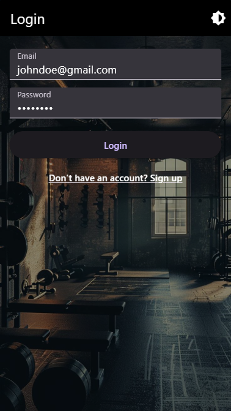
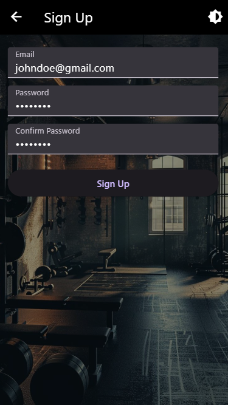
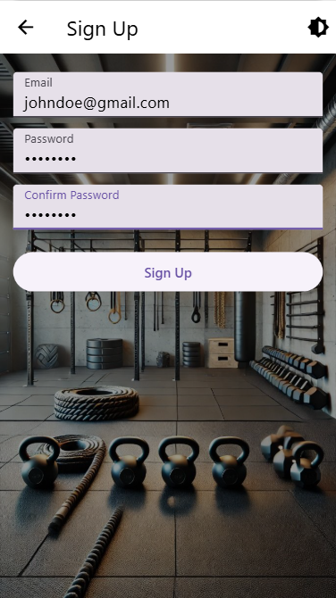
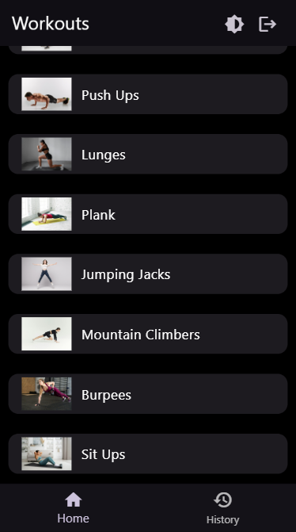
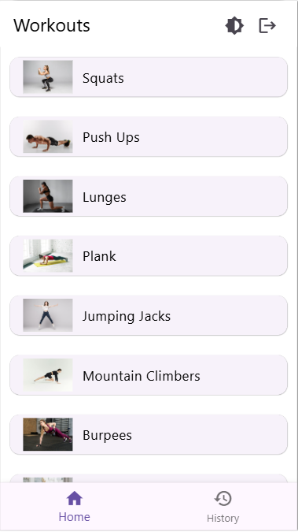
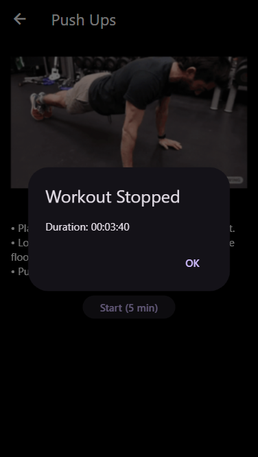
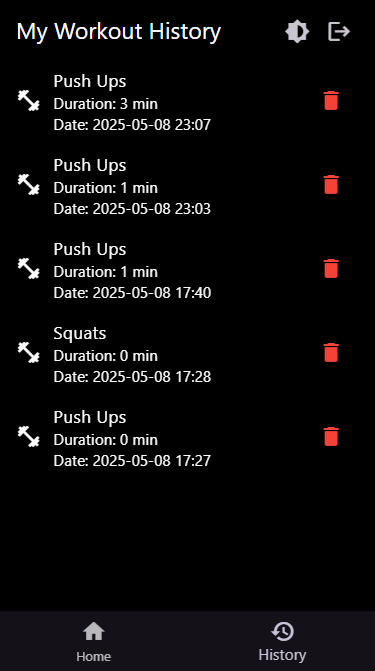
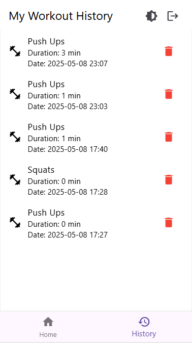

# workout-tracker

App video demo: [text](https://drive.google.com/file/d/1KhhLQlkUEbG2bMjsPtNu1Sw26HkWyrF5/view?usp=sharing)

## Getting Started

Prerequisites 
- Flutter needs to be installed on laptop/pc 
- Environment variables needs to be updated
- Emulator or real device

### Steps: 

1. Clone the repository
2. ```bash flutter pub get` - to install all dependencies
3. Create account on supabase it is same as firebase setup 
   - Create new project as "workout_tracker"
   - Create a table named "workout_logs" which will have followed columns
     * Name: created_at - type: timestamptz - tick on IsPrimaryKey 
     * Name: user_id - type: uuid
     * Name: detail - type: text
     * Name: duration - type: time
     * Name: id - type - int2
   - Enable Row Level Security (RLS) 
     * Add below query on SQL Editor - this will allow users to delete only their own logs
```bash 
    CREATE POLICY "Users can delete their own logs"
    ON workout_logs
    FOR DELETE
    USING (auth.uid() = user_id); 
```
   - Goto Project settings -> Data API -> from there you will get 
     * SUPABASE_URL= {Project URL -> URL}
     * SUPABASE_ANON_KEY= {Project API Keys -> anon public}
4. Add SUPABASE_URL and SUPABASE_ANON_KEY to .env.local and if this doesn't work then directly invoke on main.dart file 
5. This all should work, If you need any assistant then contact me on my socials 

## Screenshots 

<p>
    
    
    
    
</p>

<p>
    
    
</p>

<p>
    
    
</p>

<p>
    
    
</p>

<p>
    
    
    
</p>